<div align="center">

# MILO 🐈

**Your personal productivity companion.**

*“Track your day. Understand your habits. See your progress. Become better than yesterday.”*

[](https://github.com/Priyanshukumar2904/MILO/releases/latest)
[](https://developer.android.com)
[](https://kotlinlang.org)
[](https://developer.android.com/jetpack/compose)
[-orange?style=flat-square)](https://developer.android.com/training/data-storage/room)
[](LICENSE)

<br/>

<a href="https://github.com/Priyanshukumar2904/MILO/releases/latest/download/Milo.apk">
  
</a>
<a href="#see-milo-in-action">
  
</a>
<a href="https://github.com/Priyanshukumar2904/MILO/releases/latest">
  
</a>

<br/><br/>

[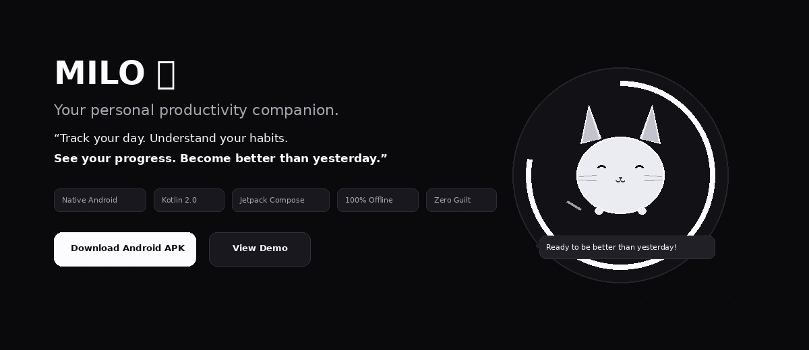](https://github.com/Priyanshukumar2904/MILO/raw/main/milo_demo.mp4)

</div>

---

## ✦ Quick Links
- 📥 **Direct APK Download**: [`Milo.apk`](https://github.com/Priyanshukumar2904/MILO/releases/latest/download/Milo.apk)
- 📦 **Latest GitHub Release**: [MILO Releases](https://github.com/Priyanshukumar2904/MILO/releases/latest)
- 🎬 **1080p Video Demonstration**: [`milo_demo.mp4`](./milo_demo.mp4)
- 🔄 **Self-Hosted Update Manifest**: [`update.json`](./update.json)
- 🛠️ **Developer Single-Command CLI**: [`./milo`](#development-command-center)

---

## ✦ About MILO
Most productivity applications are built like punitive surveillance checklists—they guilt-trip you with broken streaks, induce cognitive burnout, and demand perfection. 

**MILO is designed differently.**

Built natively for Android with **Kotlin** and **Jetpack Compose**, MILO acts as your personal operating system for gradual, sustainable self-improvement. It celebrates showing up, acknowledges rest as recovery, and gives you deep behavioral clarity across your days, weeks, and months.

### Core Pillars:
1. **0–100 Modular Scoring**: Transparent composite score weighted across task completion (25%), time management (20%), deep focus stamina (20%), habit discipline (20%), and routine consistency (15%).
2. **Continuous Improvement Delta**: Real-time comparison against yesterday’s baseline (`▲ +9% Better`).
3. **Milo the Companion**: An expressive, procedural canvas mascot with 8 emotional states who cheers your wins and supports you on slower days without guilt.
4. **Resilient Habit Matrices**: Visual 7-day completion matrices and 4-week velocity curves that never shame missed days.
5. **The Monthly Life Report**: A milestone retrospective anchored by the signature philosophy: *“You showed up.”*
6. **100% Offline Data Sovereignty**: Backed by encrypted local Room SQLite with zero mandatory external servers.

---

## # See MILO in Action

The user flow is natural, fluid, and continuous:

```
   ┌──────────────┐          ┌──────────────┐          ┌───────────────────┐
   │    Today     │  ──────► │   Schedule   │  ──────► │ Complete Activity │
   │  Dashboard   │          │ Time-Block   │          │   & Start Timer   │
   └──────────────┘          └──────────────┘          └─────────┬─────────┘
                                                                 │
   ┌──────────────┐          ┌──────────────┐          ┌─────────▼─────────┐
   │ Monthly Life │  ◄────── │    Weekly    │  ◄────── │ Productivity Delta│
   │    Report    │          │ Performance  │          │   Increases (+9%) │
   └──────────────┘          └──────────────┘          └───────────────────┘
```

<div align="center">
  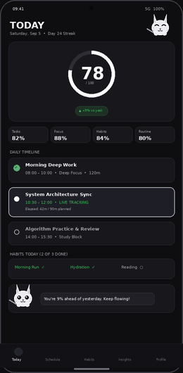
  <p><em>Lightweight animated sequence: Today OS → Time-Blocking → Habit Matrix → Insights → Monthly Life Report</em></p>
</div>

---

## ✦ Screenshots

<div align="center">
<table>
  <tr>
    <td align="center"><b>Today (Dark Mode)</b></td>
    <td align="center"><b>Today (Light Mode)</b></td>
    <td align="center"><b>Schedule (Time-Blocking)</b></td>
  </tr>
  <tr>
    <td>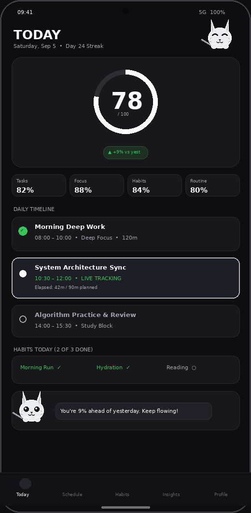</td>
    <td>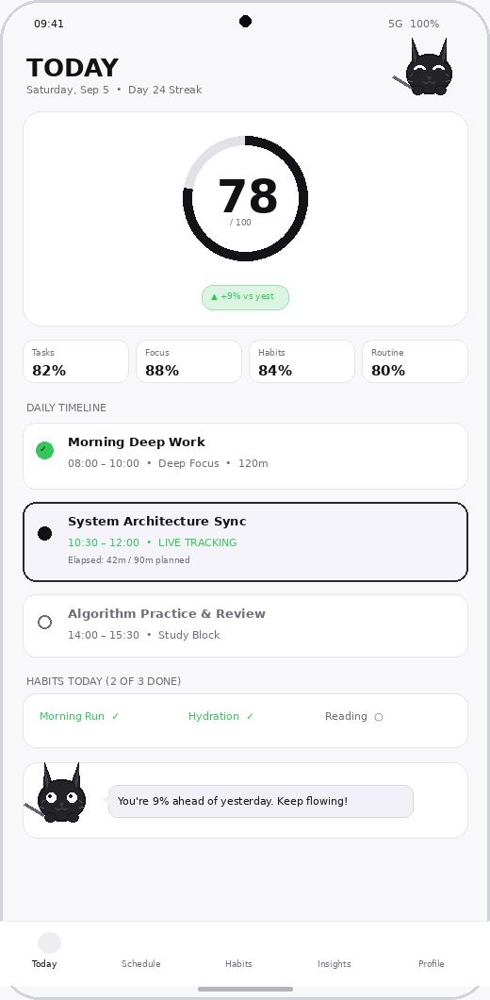</td>
    <td>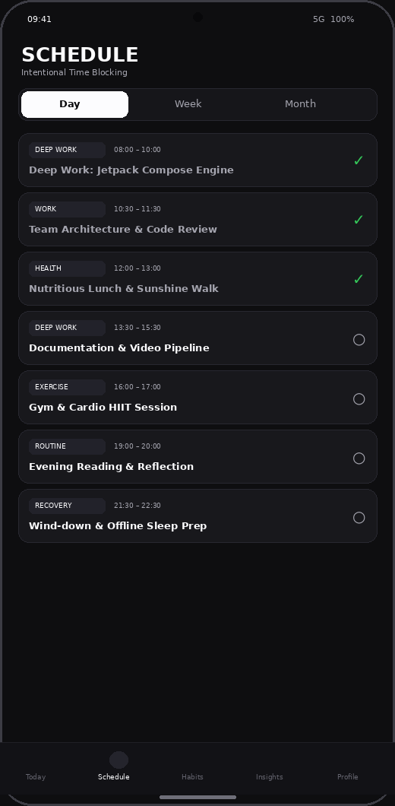</td>
  </tr>
  <tr>
    <td align="center"><b>Habit Matrix</b></td>
    <td align="center"><b>Behavioral Insights</b></td>
    <td align="center"><b>Weekly Report</b></td>
  </tr>
  <tr>
    <td>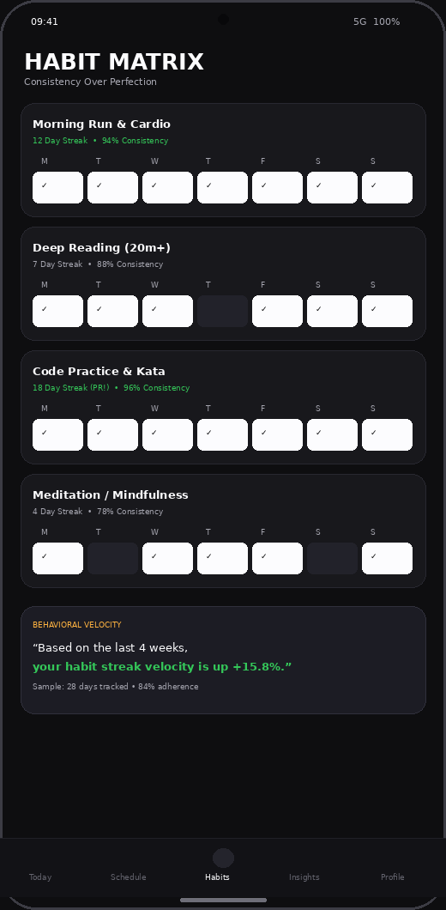</td>
    <td>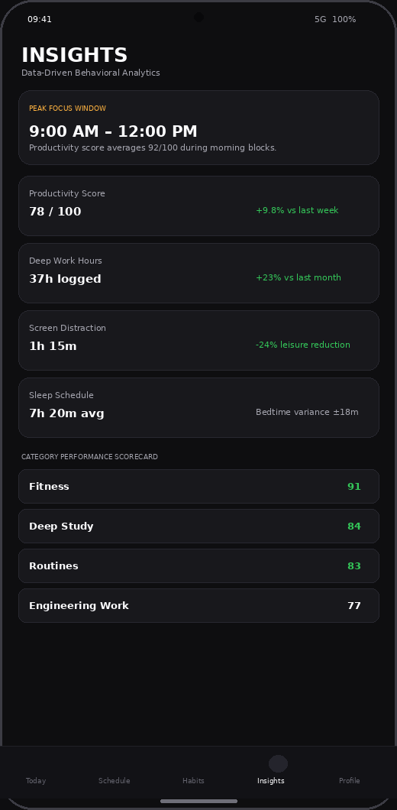</td>
    <td>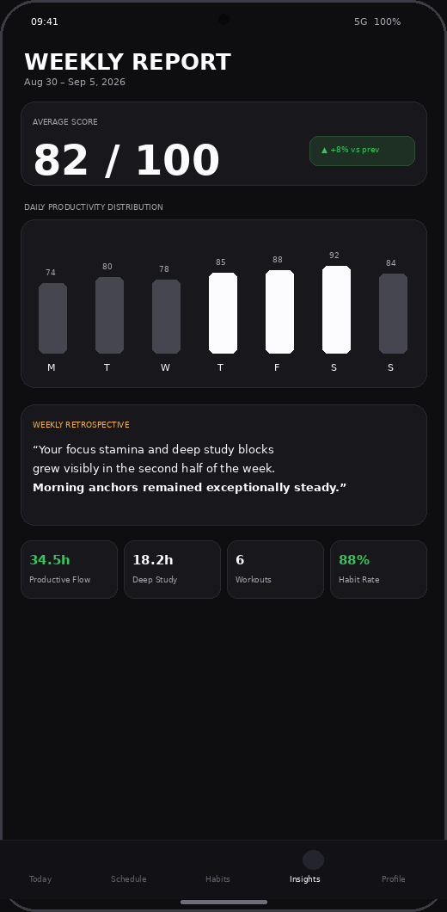</td>
  </tr>
  <tr>
    <td align="center"><b>Monthly Life Report</b></td>
    <td align="center"><b>Achievements</b></td>
    <td align="center"><b>Milo Companion States</b></td>
  </tr>
  <tr>
    <td>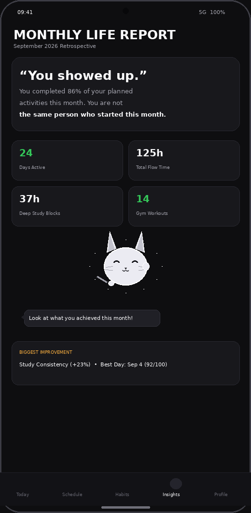</td>
    <td>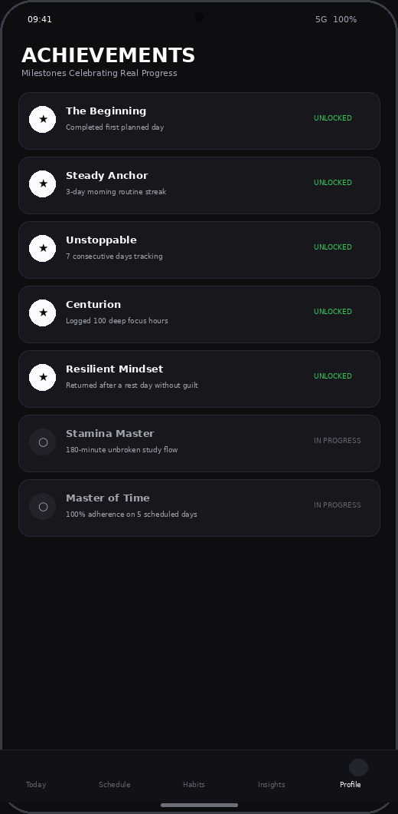</td>
    <td>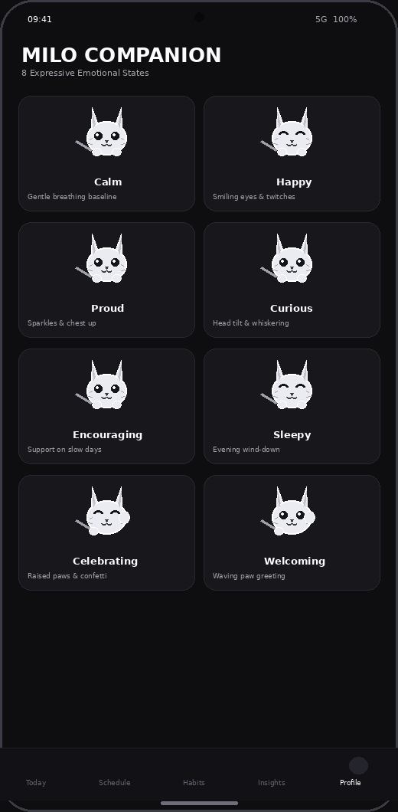</td>
  </tr>
</table>
</div>

---

## ✦ Download MILO for Android

### Method 1: Direct APK Download
1. Download the latest release asset: [**Download `Milo.apk`**](https://github.com/Priyanshukumar2904/MILO/releases/latest/download/Milo.apk)
2. On your Android phone, tap the downloaded APK.
3. If prompted by Android (*"For your security, your phone is not allowed to install unknown apps from this source"*), tap **Settings** and toggle **Allow from this source**.
4. Tap **Install**, then open **MILO**.

### Method 2: One-Command USB Installation (Developers)
Connect your Android phone with **USB Debugging** enabled and run:
```bash
./milo install
```
MILO will automatically build, install, and launch on your phone.

---

## ✦ Development Command Center

You never need to memorize complex Gradle commands. The root executable `./milo` manages the entire development lifecycle:

```bash
./milo <command>
```

| Command | Action |
| :--- | :--- |
| `./milo` or `./milo run` | Launch MILO on Android Emulator / laptop preview |
| `./milo install` | Detect USB phone, install debug APK, and launch app |
| `./milo apk` | Build release APK (`dist/Milo.apk`) with SHA-256 hash |
| `./milo apk debug` | Build fast debug APK for rapid iteration |
| `./milo release` | Run tests, build APK, update manifest, and publish to GitHub Releases |
| `./milo screenshots` | Regenerate all 10 high-resolution screenshots & demo GIF |
| `./milo test` | Run the full unit test suite (Scoring, Analytics, Verifier) |
| `./milo clean` | Clean all build caches and generated artifacts |
| `./milo update` | Validate `update.json` manifest syntax and remote assets |
| `./milo help` | Print beginner-friendly command guide |

---

## ✦ Running on Laptop (Android Emulator)

### Prerequisites
1. **Java 21**: Temurin / OpenJDK 21
2. **Android Studio**: Download from [developer.android.com/studio](https://developer.android.com/studio)

### Setup Steps
1. **Clone the repository**:
   ```bash
   git clone https://github.com/Priyanshukumar2904/MILO.git
   cd MILO
   ```
2. **Create an Android Virtual Device (AVD)**:
   - In Android Studio, open **Virtual Device Manager**.
   - Create a device profile: **Pixel 8**, System Image **API 35** (VanillaIceCream).
3. **Launch MILO**:
   ```bash
   ./milo run
   ```
   The script detects the emulator, builds the debug package, and starts the application immediately.

---

## ✦ Developer Demo Controls

MILO includes an internal developer menu located under **Profile → DEVELOPER DEMO CONTROLS**:
- **High Flow (92)**: Instantly simulates a peak performance day with high score and proud mascot reactions.
- **Rest Day (42)**: Simulates a slower day to verify gentle, supportive feedback without streak-shaming.
- **+ Achievement**: Triggers dynamic achievement unlock modals.
- **+ Record**: Adds personal best records.
- **Reset 30-Day Historical Data**: Resets local Room SQLite to pre-populated realistic data from August 6 to September 4, 2026.

---

## ✦ Verified Self-Hosted Update Architecture

MILO operates autonomously without dependency on Google Play:
1. **Check for Updates**: App queries the remote HTTPS manifest ([`update.json`](./update.json)).
2. **Cryptographic Verification**: The downloaded APK is validated client-side with [`UpdateVerifier.kt`](app/src/main/java/com/milo/app/domain/engine/UpdateVerifier.kt) using SHA-256 before handing off to Android’s `PackageInstaller`.
3. **Data Preservation**: Room migrations ensure user history and settings survive updates seamlessly.

---

## ✦ Architecture & Project Map

```
MILO/
├── milo                     # Developer CLI single-command orchestrator
├── app/
│   ├── src/main/
│   │   ├── java/com/milo/app/
│   │   │   ├── MainActivity.kt          # Root Activity & navigation host
│   │   │   ├── domain/engine/           # Scoring, Analytics, Insights, Verifier
│   │   │   ├── data/local/              # Room DB, DAOs, Entities, Converters
│   │   │   ├── ui/mascot/               # MiloCompanion canvas rendering
│   │   │   ├── ui/screens/              # Today, Schedule, Habits, Insights, Profile
│   │   │   └── ui/dialogs/              # Daily, Weekly, Monthly Life Reports, Zen Focus
│   │   └── res/                         # Strings, themes, file provider paths
│   └── src/test/                        # Unit tests for scoring & analytics
├── dist/                                # Release APK output directory
├── docs/
│   ├── screenshots/                     # 10 UI screenshots in dark & light
│   └── demo/                            # milo-demo.gif walkthrough
├── scripts/
│   ├── release.sh                       # Automated GitHub release script
│   └── generate_screenshots.py          # Screenshot & GIF renderer
├── update.json                          # Distribution manifest
├── milo_demo.mp4                        # Full 1080p demonstration video
└── build.gradle.kts
```

---

## ✦ License
This project is open source and available under the [MIT License](LICENSE).
